# Voxtral, FluidAudio, and Parakeet: A Deep Technical Map of the Modern Local Speech Stack

The speech stack has split into three very different shapes.

One shape is a **model family**: Voxtral. It is Mistral's audio line, with text-to-speech, speech-to-text, realtime transcription, and API-centered voice workflows.

Another shape is a **native Apple SDK**: FluidAudio. It is not one model. It is a Swift/CoreML pipeline for local transcription, voice activity detection, diarization, and TTS on macOS and iOS.

The third shape is a **recognition engine**: Parakeet. It is NVIDIA's ASR family, built around FastConformer/TDT variants, optimized for very fast and accurate speech-to-text.

They overlap, but they are not interchangeable. Comparing them as if they were three copies of Whisper misses the important part: each one lives at a different layer of the audio application stack.

This article is a field guide for choosing the right layer.

## One-Screen Verdict

Use **Voxtral** when you want speech generation, Mistral-hosted audio services, realtime STT APIs, voice-agent workflows, or a local MLX TTS model with preset voices.

Use **FluidAudio** when you are building a private, native Apple app and you need local ASR, VAD, speaker diarization, or lightweight TTS through Swift/CoreML.

Use **Parakeet** when the core job is transcription speed and accuracy. Use it through NVIDIA NeMo/NIM on CUDA systems, or through FluidAudio's CoreML ports on Apple Silicon.

Use **Qwen3-TTS or Higgs Audio through MLX-Audio** when you specifically need local voice cloning on Apple Silicon. That is not the same as local Voxtral voice cloning.

## The Map

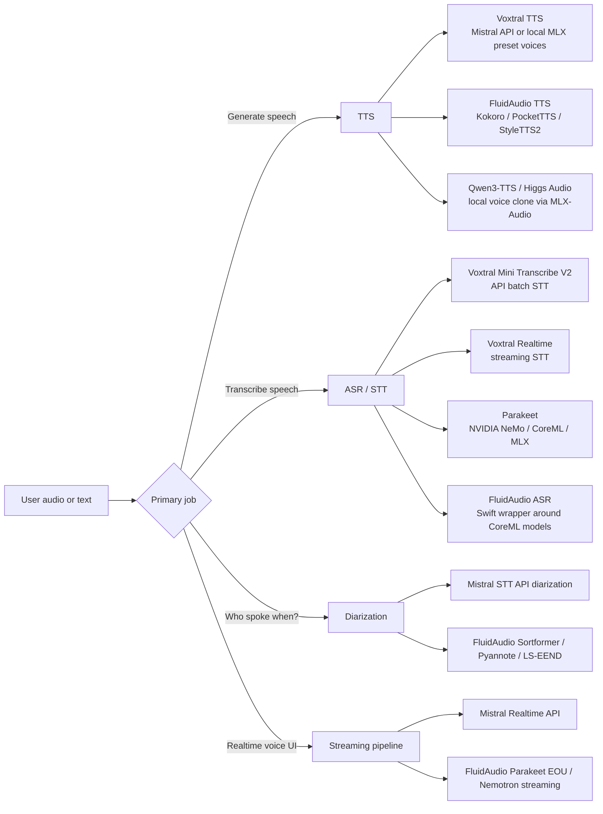

The essential distinction:

| System | What it is | Best at | Not best at |
|---|---|---|---|
| Voxtral | Mistral audio model family and APIs | TTS, voice agents, managed STT, realtime API workflows | Local Apple-native app integration; public local Voxtral voice cloning |
| FluidAudio | Swift/CoreML audio SDK | Local macOS/iOS apps, ASR, VAD, diarization, lightweight TTS | Being a single benchmarkable model |
| Parakeet | NVIDIA ASR model family | Fast transcription with timestamps | TTS, voice cloning, diarization by itself |

## Verified Facts at a Glance

The table below deliberately mixes capabilities and deployment facts, because that is how engineering decisions are actually made.

| Topic | Voxtral | FluidAudio | Parakeet |
|---|---|---|---|
| Category | Mistral audio model family | Swift/CoreML SDK and model pipelines | NVIDIA ASR model family |
| Main modes | TTS, batch STT, realtime STT | ASR, streaming ASR, VAD, diarization, TTS | ASR |
| Local Apple path | Voxtral TTS through MLX-Audio; public local model uses preset voices | Native CoreML/Swift on macOS and iOS | Through FluidAudio CoreML ports or MLX ports |
| Hosted/server path | Mistral API; vLLM Omni for local server GPU TTS | Not the primary design center | NVIDIA NeMo/NIM/Riva on NVIDIA GPU |
| TTS | Yes | Yes | No |
| Voice cloning | Mistral API supports saved voices and one-off reference audio; local public MLX Voxtral does not expose ref-audio cloning | Yes via some TTS pipelines such as StyleTTS2; Kokoro/PocketTTS are different TTS paths | No |
| ASR | Yes, Voxtral Mini Transcribe V2 and Voxtral Realtime | Yes, including Parakeet TDT variants | Yes |
| Diarization | Yes in Mistral STT API | Yes: Pyannote, Sortformer, LS-EEND pipelines | No, not by itself |
| Timestamps | Yes in Mistral STT | Yes depending on pipeline | Yes: word and segment timestamps in Parakeet TDT |
| Local license caveat | Voxtral 4B TTS weights are CC BY-NC 4.0 | SDK is Apache-2.0; model licenses vary; FluidAudioTTS adds GPL-3.0 ESpeakNG dependency | Parakeet v3 is CC-BY-4.0; v2 has NVIDIA terms |

Sources: Mistral Voxtral TTS docs and model card, Mistral STT/TTS docs, FluidAudio docs and benchmarks, NVIDIA/Hugging Face Parakeet cards, linked throughout this article.

## Why This Comparison Is Easy to Get Wrong

There are three common mistakes.

First, people compare Voxtral TTS to Parakeet. That is a category error. Voxtral TTS speaks. Parakeet listens.

Second, people compare FluidAudio to a single model. FluidAudio is closer to an application runtime layer: Swift APIs, CoreML packaging, audio conversion, ASR managers, diarizers, VAD managers, and TTS backends.

Third, people collapse "voice cloning" into one feature flag. In practice there are several technically different workflows:

- Reference-audio prompt conditioning.
- Saved voice identities.
- Speaker embeddings.
- Zero-shot TTS with transcript.
- Zero-shot TTS without transcript.
- Preset voice selection.

These are not equivalent. They differ in privacy, latency, quality, consent surface, model availability, and whether they can run locally.

## The Three Systems

### Voxtral: A Speech Product Line, Not Just One Checkpoint

Voxtral currently matters in two separate ways.

The first is **Voxtral TTS**, Mistral's text-to-speech model. The [Mistral model card](https://docs.mistral.ai/models/model-cards/voxtral-tts-26-03) describes `voxtral-mini-tts-2603` as supporting 9 languages, streaming with roughly 90 ms time-to-first-audio, and zero-shot voice cloning in the hosted path. The official Hugging Face TTS weights are published as [`mistralai/Voxtral-4B-TTS-2603`](https://huggingface.co/mistralai/Voxtral-4B-TTS-2603), with a CC BY-NC 4.0 license and 20 preset voices across 9 languages.

The second is **Voxtral STT/realtime transcription**, exposed by [Mistral's Audio & Transcription docs](https://docs.mistral.ai/studio-api/audio/speech_to_text). Mistral lists Voxtral Mini Transcribe V2 for batch transcription with speaker diarization, context biasing, word-level timestamps, multilingual support across 13 languages, noise robustness, and long audio support up to 3 hours in one request. Mistral also lists Voxtral Realtime for streaming STT, with configurable sub-200 ms latency, a 4B parameter footprint, and open weights under Apache 2.0 for edge deployment.

That makes Voxtral a family with both "talk" and "listen" branches.

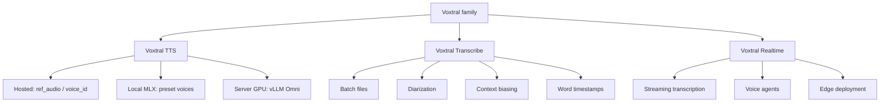

#### Voxtral TTS: official and local paths

The official local server path for `mistralai/Voxtral-4B-TTS-2603` is vLLM Omni. The [Hugging Face model card](https://huggingface.co/mistralai/Voxtral-4B-TTS-2603) says the BF16 model can run on a single GPU with at least 16 GB memory and shows a `vllm serve mistralai/Voxtral-4B-TTS-2603 --omni` deployment path.

On Apple Silicon, the practical path is MLX-Audio with an MLX-converted model:

```bash
uv venv --python 3.12 --seed
source .venv/bin/activate

uv pip install -U mlx-audio "mistral-common[audio]" "huggingface_hub[hf_xet]"

mkdir -p audio
mlx_audio.tts.generate \
  --model mlx-community/Voxtral-4B-TTS-2603-mlx-4bit \
  --text "Hello, this is Voxtral running locally on Apple Silicon." \
  --voice casual_male \
  --output_path ./audio \
  --file_prefix voxtral_local \
  --verbose
```

The [MLX 4-bit model card](https://huggingface.co/mlx-community/Voxtral-4B-TTS-2603-mlx-4bit) lists the model as about 2.5 GB and gives Apple Silicon RTF values for the 4-bit, 6-bit, and BF16 variants. It also lists the 20 local preset voices:

- English: `casual_male`, `casual_female`, `cheerful_female`, `neutral_male`, `neutral_female`.
- French: `fr_male`, `fr_female`.
- Spanish: `es_male`, `es_female`.
- German: `de_male`, `de_female`.
- Italian: `it_male`, `it_female`.
- Portuguese: `pt_male`, `pt_female`.
- Dutch: `nl_male`, `nl_female`.
- Arabic: `ar_male`.
- Hindi: `hi_male`, `hi_female`.

There is an important caveat: the public local MLX Voxtral path uses the bundled voice embeddings and preset voice names. The generic `mlx_audio.tts.generate` CLI has `--ref_audio`, but the installed Voxtral path in this workspace does not turn a reference WAV into a Voxtral voice embedding. In other words, **local Voxtral TTS works; local Voxtral voice cloning from arbitrary reference audio is not exposed by the public local model path tested here**.

#### Voxtral hosted voice cloning

[Mistral's speech generation docs](https://docs.mistral.ai/studio-api/audio/text_to_speech/speech) say the API can generate speech from either a saved voice (`voice_id`) or one-off reference audio (`ref_audio`). The [saved-voice docs](https://docs.mistral.ai/studio-api/audio/text_to_speech/voices) describe creating reusable voices from a base64-encoded audio sample.

```python
import base64
from pathlib import Path
from mistralai.client import Mistral

client = Mistral(api_key="your-api-key")
sample_audio_b64 = base64.b64encode(Path("sample.mp3").read_bytes()).decode()

voice = client.audio.voices.create(
    name="my-voice",
    sample_audio=sample_audio_b64,
    sample_filename="sample.mp3",
    languages=["en"],
    gender="male",
)

print(voice.id)
```

For one-off reference audio:

```python
import base64
from pathlib import Path
from mistralai.client import Mistral

client = Mistral(api_key="your-api-key")
ref_audio = base64.b64encode(Path("voice_sample.wav").read_bytes()).decode()

response = client.audio.speech.complete(
    model="voxtral-mini-tts-2603",
    input="This is generated from a one-off reference voice sample.",
    ref_audio=ref_audio,
    response_format="mp3",
)

Path("output.mp3").write_bytes(base64.b64decode(response.audio_data))
```

That is powerful, but it is not local.

### FluidAudio: The Apple-Native Audio Runtime Layer

[FluidAudio describes itself](https://docs.fluidinference.com/introduction) as local audio AI for Apple devices, covering speech-to-text, speaker diarization, voice activity detection, and text-to-speech on the Apple Neural Engine. It is a Swift SDK, not a single model.

Its docs list:

- Transcription with Parakeet TDT 0.6B.
- Streaming ASR with Parakeet EOU 120M.
- Speaker diarization with Pyannote CoreML and Sortformer.
- VAD with Silero.
- TTS with Kokoro and PocketTTS.
- macOS 14+ / iOS 17+, Swift 5.10+, Apple Silicon recommended.

The key idea is that FluidAudio packages the hard parts of Apple audio ML:

- CoreML model staging and loading.
- Audio conversion to the shape each model expects.
- Swift async APIs.
- Batch and streaming modes.
- Speaker diarization pipelines.
- VAD gating.
- TTS backends.
- Optional TTS products with different dependency/licensing surfaces.

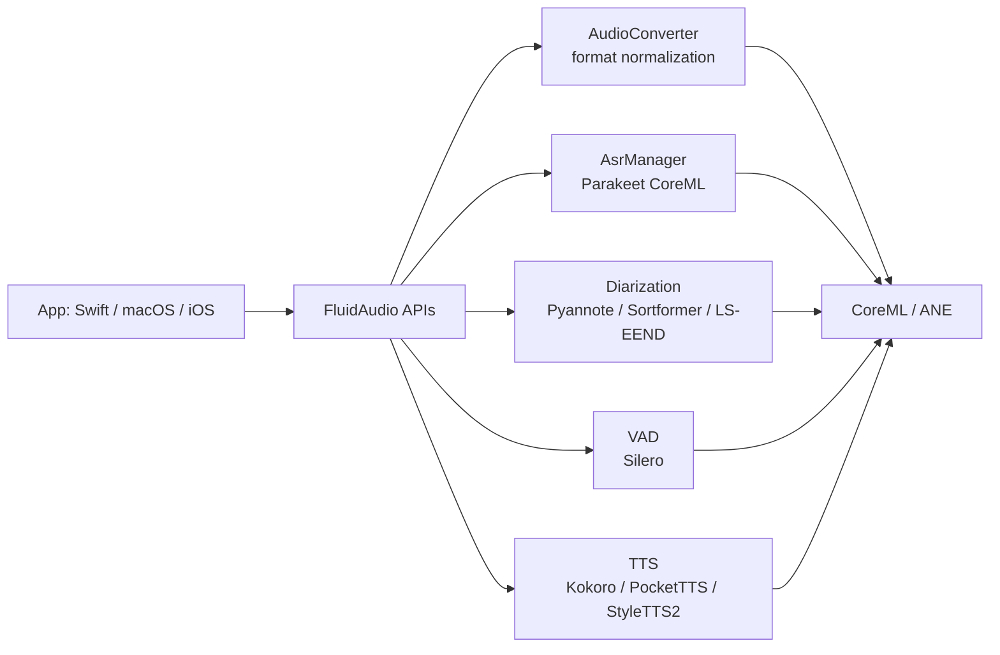

#### FluidAudio install

The [installation docs](https://docs.fluidinference.com/installation) show Swift Package Manager usage:

```swift
dependencies: [
    .package(url: "https://github.com/FluidInference/FluidAudio.git", from: "0.7.9"),
]
```

The package exposes two relevant products:

```swift
// Core features: ASR, diarization, VAD.
.product(name: "FluidAudio", package: "FluidAudio")

// TTS support. Includes ESpeakNG framework.
.product(name: "FluidAudioTTS", package: "FluidAudio")
```

That product split matters. FluidAudio's install docs state that `FluidAudio` is the lightweight core product and that `FluidAudioTTS` adds Kokoro TTS and includes ESpeakNG, a GPL-3.0 dependency. For a commercial app, that split is not just a build detail. It is a licensing and distribution decision.

#### FluidAudio batch ASR example

The [ASR getting-started docs](https://github.com/FluidInference/FluidAudio/blob/main/Documentation/ASR/GettingStarted.md) show batch transcription with `AsrModels`, `AsrManager`, and `transcribe`.

```swift
import FluidAudio

Task {
    let models = try await AsrModels.downloadAndLoad(version: .v3)
    let asrManager = AsrManager(config: .default)
    try await asrManager.configure(models: models)

    let audioURL = URL(fileURLWithPath: "/path/to/audio.wav")
    let result = try await asrManager.transcribe(audioURL, source: .system)

    print("Transcription: \(result.text)")
    print("Confidence: \(result.confidence)")
}
```

FluidAudio's docs explicitly warn not to hand-parse WAV/PCM bytes and instead use its audio conversion path so compressed formats, channel layouts, metadata chunks, and bit depth differences become the expected 16 kHz mono Float32 samples.

That warning is mundane and important. Most production ASR bugs are not "the model is bad"; they are "the audio tensor is not what the model was trained to see."

#### FluidAudio CLI examples

The docs also show CLI examples:

```bash
swift run fluidaudiocli transcribe audio.wav

swift run fluidaudiocli transcribe audio.wav --model-version v2

swift run fluidaudiocli multi-stream audio1.wav audio2.wav

swift run fluidaudiocli asr-benchmark --subset test-clean --max-files 50
```

FluidAudio is the most natural choice if the end product is a macOS menu bar app, iOS dictation keyboard, native meeting recorder, offline transcription tool, or local voice assistant.

### Parakeet: The Recognition Engine

Parakeet is NVIDIA's ASR family. In this comparison, the key public model is `nvidia/parakeet-tdt-0.6b-v3`, a 600M parameter multilingual ASR model. NVIDIA and Hugging Face describe it as extending v2 from English to 25 European languages, automatically detecting language, producing punctuation and capitalization, and supporting word and segment timestamps.

[NVIDIA's NIM model card](https://build.nvidia.com/nvidia/parakeet-tdt-0_6b-v2/modelcard) describes the architecture as FastConformer-TDT. It says v2 is English-only and v3 covers 25 European languages. It also states that v3 supports long audio up to 24 minutes with full attention on A100 80GB, or up to 3 hours with local attention.

Parakeet is therefore a strong ASR component, but not a full audio product stack.

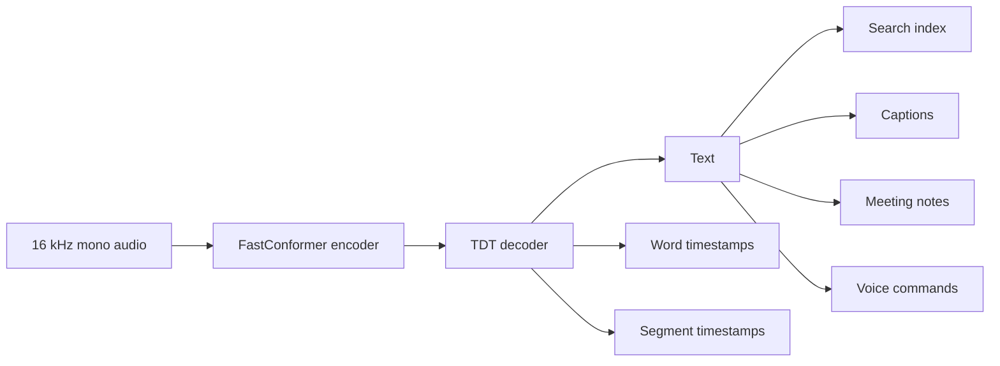

#### Parakeet through NeMo

NVIDIA's model card shows NeMo usage:

```bash
pip install -U "nemo_toolkit[asr]"
```

```python
import nemo.collections.asr as nemo_asr

asr_model = nemo_asr.models.ASRModel.from_pretrained(
    model_name="nvidia/parakeet-tdt-0.6b-v3"
)

output = asr_model.transcribe(["audio.wav"])
print(output[0].text)
```

With timestamps:

```python
output = asr_model.transcribe(["audio.wav"], timestamps=True)

word_timestamps = output[0].timestamp["word"]
segment_timestamps = output[0].timestamp["segment"]

for stamp in segment_timestamps:
    print(f"{stamp['start']}s - {stamp['end']}s: {stamp['segment']}")
```

That is the NVIDIA-centered path: NeMo, CUDA, Linux, and NVIDIA GPUs.

For Apple Silicon, the more ergonomic route is not NeMo. It is a converted CoreML path through FluidAudio, or an MLX port if your Python stack is already MLX-centered.

## The Deep Comparison

### 1. Layer of Abstraction

Voxtral sits at the **model and API** layer.

FluidAudio sits at the **application runtime** layer.

Parakeet sits at the **ASR model** layer.

This is the most important design distinction. It determines what you get out of the box.

| Requirement | Voxtral | FluidAudio | Parakeet |
|---|---|---|---|
| "I need speech output" | Strong | Available through selected TTS backends | No |
| "I need transcription" | Strong through Mistral STT | Strong through Parakeet/Qwen/Cohere CoreML pipelines | Strong |
| "I need realtime low-latency STT" | Strong through Mistral Realtime | Strong for local Apple apps | Specialized streaming variants needed |
| "I need diarization" | Available in Mistral STT API | Native pipeline support | Needs another component |
| "I need an iOS SDK" | Not the obvious path | Best fit | Needs wrapper/conversion |
| "I need local macOS command-line experiments" | Good for TTS via MLX | Good if using Swift CLI | Good through CoreML/MLX, less natural through NeMo |
| "I need server deployment on NVIDIA GPUs" | vLLM Omni for TTS; Mistral services otherwise | Not primary | Best native environment |

### 2. Locality and Privacy

There are four distinct deployment modes:

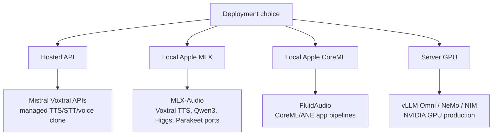

Hosted APIs reduce local setup and usually improve product polish, but they move audio to a service boundary. Local CoreML/MLX keeps audio on the device, but puts model lifecycle, memory pressure, and conversion quirks in your hands.

For privacy-first apps, FluidAudio is the cleanest Apple-native path. For local Python experiments on Apple Silicon, MLX-Audio is extremely convenient. For managed enterprise features, Mistral's APIs are more complete than the public local Voxtral path.

### 3. TTS and Voice Quality

Voxtral TTS is the most relevant system here for speech generation. Mistral's official model card emphasizes natural prosody, emotional range, 20 preset voices, 9 languages, streaming/batch inference, and 24 kHz output in multiple formats. The Hugging Face card lists WAV, PCM, FLAC, MP3, AAC, and Opus output formats for the official TTS model.

FluidAudio's TTS story is different. It is a collection of smaller or specialized CoreML TTS pipelines. The FluidAudio docs list Kokoro 82M, PocketTTS 155M, StyleTTS2, and other model sources. That makes it practical for local apps, but it is not one unified FluidAudio voice model.

Parakeet has no TTS role.

### 4. Voice Cloning

Voice cloning is where the comparison gets sharp.

| Path | Local? | Transcript needed? | Notes |
|---|---:|---:|---|
| Voxtral API `ref_audio` | No | Mistral says no transcript required for voice prompts on the TTS model card | Managed and convenient |
| Voxtral API saved `voice_id` | No | Audio sample needed to create voice | Reusable voice identity |
| Public local Voxtral MLX | Yes | Not applicable | Preset voices only in tested path |
| Qwen3-TTS MLX | Yes | Yes, for stable cloning in tested CLI flow | Good practical local route |
| Higgs Audio v2 MLX | Yes | Yes, docs recommend transcript with reference audio | Larger local clone-capable route |
| FluidAudio StyleTTS2 | Yes | Reference audio driven | English-only according to FluidAudio models docs |

This is the current engineering reality: if the words are "local voice clone on Mac", the answer is **not local Voxtral today**. It is Qwen3-TTS, Higgs Audio, StyleTTS2, or another local TTS model that actually consumes reference audio.

Local Qwen3-TTS command:

```bash
source .venv/bin/activate

ffmpeg -y -i my_voice_original.m4a -ac 1 -ar 24000 my_voice_sample.wav

mlx_audio.tts.generate \
  --model mlx-community/Qwen3-TTS-12Hz-0.6B-Base-bf16 \
  --text "Hello, this is my locally cloned voice running on Apple Silicon." \
  --ref_audio my_voice_sample.wav \
  --ref_text "Exact words spoken in my voice sample." \
  --output_path ./audio \
  --file_prefix my_local_voice_clone \
  --verbose
```

Local Higgs Audio v2 command:

```bash
mlx_audio.tts.generate \
  --model mlx-community/higgs-audio-v2-3B-mlx-q6 \
  --text "Hello, this is a local Higgs Audio voice clone." \
  --ref_audio my_voice_sample.wav \
  --ref_text "Exact words spoken in my voice sample." \
  --output_path ./audio \
  --file_prefix my_local_voice_clone_higgs \
  --verbose
```

Best practice for any clone-capable model:

- Use only your own voice or explicit consent.
- Record 10 to 30 seconds of clean, dry speech.
- Avoid music, background speech, echo, and aggressive noise suppression.
- Match reference language and target language where possible.
- Provide exact `ref_text` when the model supports or expects it.
- Keep the first clone test short.
- Treat clone quality as a distribution, not a yes/no feature.

### 5. ASR Accuracy and Speed

Parakeet is the cleanest ASR story.

[NVIDIA's Parakeet v3 model card](https://huggingface.co/nvidia/parakeet-tdt-0.6b-v3) reports 600M parameters, FastConformer-TDT architecture, 25 European languages, automatic language detection, punctuation/capitalization, word and segment timestamps, CC BY 4.0 licensing, and an average WER of 6.34% on the Hugging Face Open ASR Leaderboard table shown in the card.

[FluidAudio's benchmarks](https://github.com/FluidInference/FluidAudio/blob/main/benchmarks.md) are specifically relevant to Apple Silicon:

- Parakeet TDT-CTC-110M CoreML: 3.01% WER on LibriSpeech test-clean, 96.5x realtime on Apple M2.
- Parakeet TDT 0.6B v3 CoreML: 2.64% WER on LibriSpeech test-clean for the 8-bit palettized encoder, 47.1x realtime, 153 MB peak RAM on Apple M2 in the published benchmark table.

Mistral's STT docs describe Voxtral Mini Transcribe V2 as high accuracy, with diarization, context biasing, timestamps, 13-language support, noise robustness, and long audio up to 3 hours. However, the public Mistral docs page does not present the same directly comparable LibriSpeech table in the snippet used here. Treat it as a product capability statement, not a benchmark equivalent to Parakeet's model card or FluidAudio's benchmark page.

The apples-to-apples warning matters:

| Number type | Why it can mislead |
|---|---|
| WER on LibriSpeech | Clean audiobook speech; not the same as meetings, call centers, or accented noisy audio |
| RTFx on M2/M4 Pro | Device-specific and implementation-specific |
| CUDA throughput | Not comparable to CoreML ANE throughput |
| API latency | Includes network, batching, server load, and streaming behavior |
| Long-audio support | Often depends on attention mode, chunking, memory, and timestamp stitching |

Use benchmark numbers to shortlist, not to skip your own eval.

### 6. Streaming

Streaming is not one thing.

There is streaming TTS: generate audio early enough that playback can start before the whole utterance is done.

There is streaming ASR: emit partial transcripts while audio is arriving.

There is end-of-utterance detection: decide when the user has stopped speaking so an agent can respond.

There is streaming diarization: identify speakers as the conversation unfolds.

| Streaming job | Voxtral | FluidAudio | Parakeet |
|---|---|---|---|
| TTS streaming | Yes in Mistral TTS and MLX-Audio supports streaming flags across models | PocketTTS is positioned for fast first audio; other TTS paths vary | No |
| Realtime ASR | Voxtral Realtime | Parakeet EOU, Nemotron streaming, VAD pipelines | Dedicated streaming variants needed |
| End-of-utterance | Through realtime product stack | Parakeet EOU, VAD/debounce pipelines | Parakeet EOU variant |
| Streaming diarization | Mistral managed path, depending on product | Sortformer/streaming diarization | Not standalone |

For a local Mac voice agent, FluidAudio's streaming ASR/VAD/diarization plus a local LLM plus MLX/FluidAudio TTS is the natural architecture.

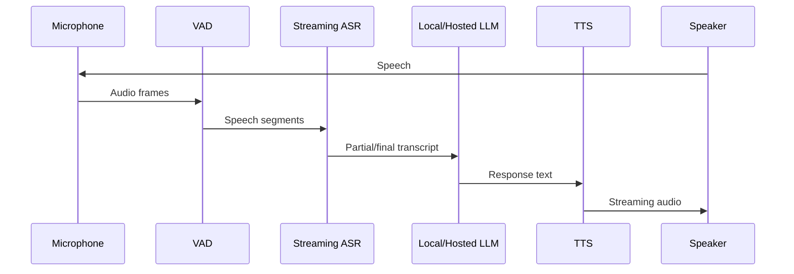

## Use Cases

### Use Case 1: Local Mac Dictation App

Best stack: FluidAudio + Parakeet CoreML.

Why:

- Fully local.
- Swift-native.
- CoreML/ANE optimized.
- Built-in audio conversion.
- Parakeet TDT v2/v3 model choice.
- Can add VAD and command routing.

Sketch:

```swift
import FluidAudio

final class DictationEngine {
    private let asrManager = AsrManager(config: .default)

    func start() async throws {
        let models = try await AsrModels.downloadAndLoad(version: .v3)
        try await asrManager.configure(models: models)
    }

    func transcribeFile(_ url: URL) async throws -> String {
        let result = try await asrManager.transcribe(url, source: .system)
        return result.text
    }
}
```

Best practices:

- Use v2 for English-only accuracy.
- Use v3 for 25 European languages.
- Normalize audio through FluidAudio APIs.
- Keep ASR and post-processing separate.
- Add a custom vocabulary or post-correction layer for names, project codenames, and acronyms.

### Use Case 2: Podcast or Meeting Transcription With Speaker Labels

Best stack: FluidAudio for local Apple; Mistral STT API if you want a managed service.

Local architecture:

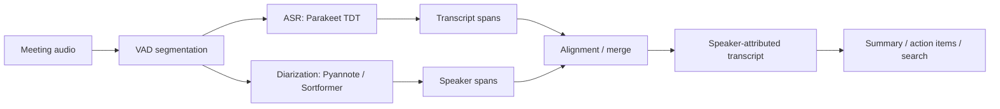

Managed architecture:

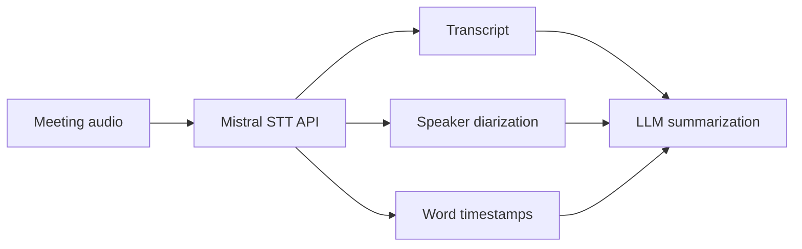

Decision rule:

- Use FluidAudio when privacy, offline operation, native Apple integration, and device-local cost control matter most.
- Use Mistral when you want one managed API with diarization, timestamps, context biasing, and long-file handling.

### Use Case 3: Audiobook or App Narration

Best stack: Voxtral TTS if preset voices are acceptable, or Mistral API if voice adaptation is required.

Local Voxtral:

```bash
mlx_audio.tts.generate \
  --model mlx-community/Voxtral-4B-TTS-2603-mlx-4bit \
  --text "Chapter one. The signal arrived just before dawn." \
  --voice neutral_female \
  --output_path ./audio \
  --file_prefix chapter_001 \
  --verbose
```

Production best practices:

- Normalize numbers and symbols into spoken form.
- Spell out abbreviations.
- Keep prompts under the model's recommended length.
- Split chapters into paragraph-sized chunks.
- Store text segment IDs with generated audio filenames.
- Run a pronunciation QA pass before batch generation.
- Use lossless WAV/FLAC for editing and MP3/Opus for delivery.

Mistral's speech generation docs recommend language matching between prompt and target for best results, spelling out numbers/symbols, avoiding rich formatting, spelling abbreviations, and keeping prompts under 300 words.

### Use Case 4: Local Voice Clone for Prototyping

Best stack: MLX-Audio + Qwen3-TTS or Higgs Audio, not local Voxtral.

Why:

- The public local Voxtral MLX path uses preset voices.
- Qwen3-TTS and Higgs Audio consume reference audio in the local MLX stack.
- You can run the entire prototype offline on Apple Silicon.

Reference recording checklist:

```text
Room: quiet, no music, no background voices
Mic: close, stable distance, no clipping
Duration: 10-30 seconds
Text: known transcript, saved verbatim
Format: mono WAV, 24 kHz for TTS clone pipelines
Consent: explicit and documented
```

Convert and run:

```bash
ffmpeg -y -i raw_reference.m4a -ac 1 -ar 24000 my_voice_sample.wav

mlx_audio.tts.generate \
  --model mlx-community/Qwen3-TTS-12Hz-0.6B-Base-bf16 \
  --text "This is a short local clone test." \
  --ref_audio my_voice_sample.wav \
  --ref_text "The exact words I said in the reference recording." \
  --output_path ./audio \
  --file_prefix clone_test \
  --verbose
```

### Use Case 5: Server-Side Transcription at Scale

Best stack: Parakeet through NeMo/NIM on NVIDIA GPUs.

Why:

- Parakeet's primary ecosystem is NVIDIA speech tooling.
- The model card targets NVIDIA GPU acceleration and lists NeMo usage.
- Timestamps and long-form transcription are first-class concerns.

Sketch:

```python
import nemo.collections.asr as nemo_asr

asr_model = nemo_asr.models.ASRModel.from_pretrained(
    model_name="nvidia/parakeet-tdt-0.6b-v3"
)

files = ["call_001.wav", "call_002.wav", "call_003.wav"]
outputs = asr_model.transcribe(files, timestamps=True)

for path, output in zip(files, outputs):
    print(path)
    print(output.text)
```

Best practices:

- Standardize audio to 16 kHz mono.
- Batch by duration buckets.
- Persist word timestamps separately from text.
- Track WER on your own domain audio.
- Add post-processing for numbers, product names, and formatting.
- Do not mix benchmark datasets with production quality claims.

## Implementation Approaches

### Approach A: Python Local Lab on Apple Silicon

Use this when you are exploring models, building demos, or generating assets.

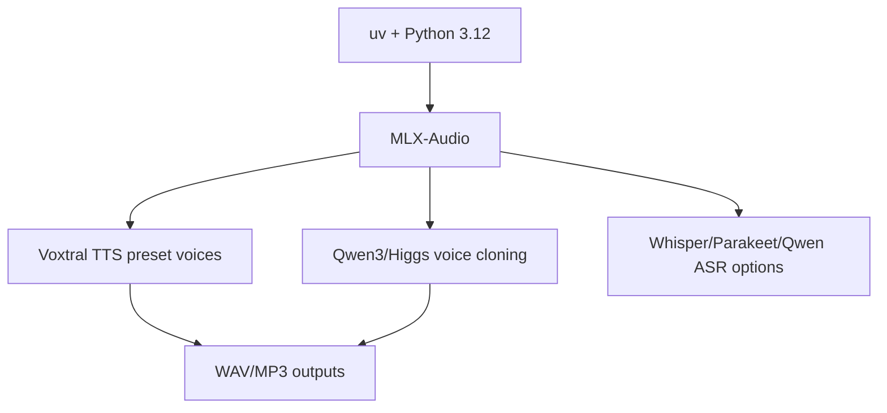

Pros:

- Fast iteration.
- Works well on Apple Silicon.
- Easy to compare TTS models.
- Good for notebooks and scripts.

Cons:

- Not a native app experience.
- Model APIs vary.
- Local model availability changes quickly.
- Voice cloning quality depends strongly on model choice and reference audio.

### Approach B: Native Apple Product

Use this for dictation apps, meeting tools, offline transcription, local assistants, and iOS keyboards.

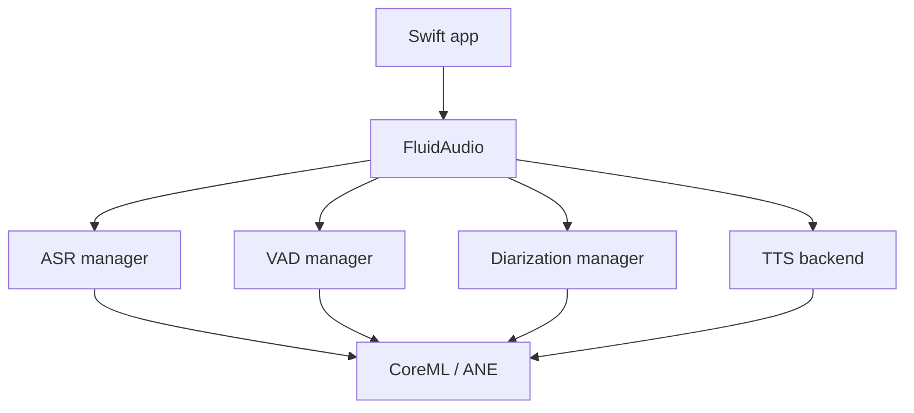

Pros:

- Native Swift APIs.
- CoreML and ANE integration.
- Good deployment fit for macOS/iOS.
- Local privacy story.
- VAD and diarization are part of the same ecosystem.

Cons:

- Swift/CoreML expertise required.
- Model packaging and app size need planning.
- TTS product choices have licensing implications.
- Benchmarking must be device-specific.

### Approach C: Hosted Mistral Speech App

Use this when you need managed speech features quickly.

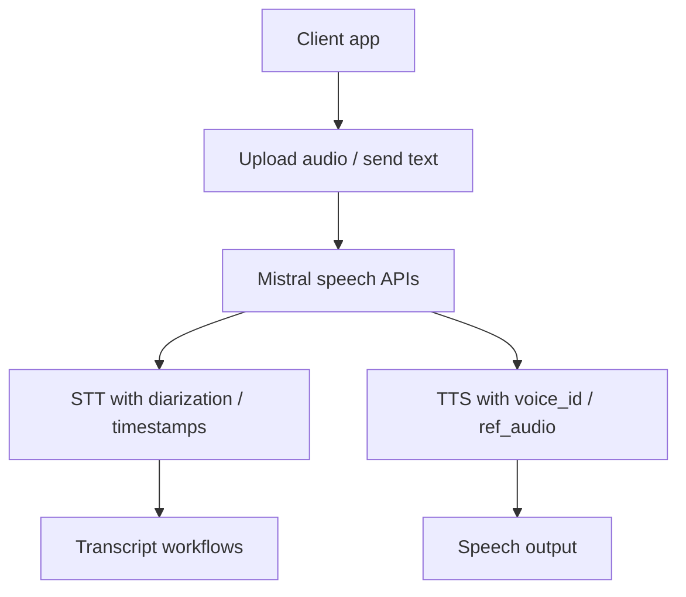

Pros:

- Managed infrastructure.
- TTS voice cloning path.
- STT features such as diarization and context biasing.
- Lower local model complexity.

Cons:

- Audio leaves the device.
- Requires API keys, billing, network, and policy compliance.
- Harder to guarantee offline behavior.

### Approach D: NVIDIA GPU ASR Service

Use this for high-throughput backend transcription.

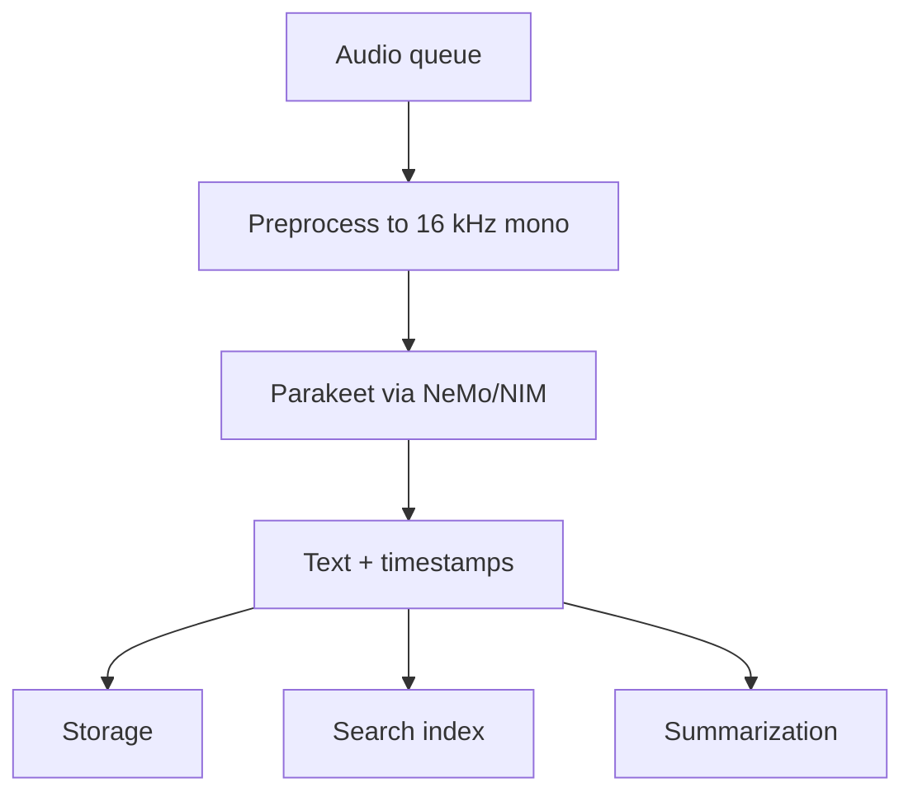

Pros:

- Parakeet's native ecosystem.
- Strong ASR focus.
- Timestamps and long-form support.
- Good fit for GPU-backed batch services.

Cons:

- CUDA/NVIDIA infrastructure.
- Diarization requires additional components.
- No TTS.
- Not the easiest local Mac route.

## Best Practices That Survive Model Churn

### 1. Treat Audio Conversion as a First-Class Component

Most ASR models expect specific sample rates and channel layouts. Parakeet's model card specifies 16 kHz mono audio input. FluidAudio docs warn against parsing WAV/PCM bytes by hand and recommend its `AudioConverter` path.

Rule:

```text
Never feed "whatever came from the microphone" directly into ASR.
Always normalize sample rate, channel count, dtype, and loudness.
```

Practical defaults:

```bash
# ASR-oriented normalization
ffmpeg -y -i input.m4a -ac 1 -ar 16000 asr_input.wav

# TTS reference voice sample
ffmpeg -y -i input.m4a -ac 1 -ar 24000 voice_reference.wav
```

### 2. Benchmark on Your Audio, Not Just LibriSpeech

LibriSpeech is clean. Your users are not.

Build a small eval set:

```text
10 clean single-speaker clips
10 noisy clips
10 meetings with overlapping speech
10 domain-heavy clips with names and acronyms
10 accented or multilingual clips
```

Track:

- WER.
- Character error rate.
- Proper noun recall.
- Timestamp drift.
- Speaker label error.
- Latency to first partial.
- End-of-utterance delay.
- Peak memory.
- Battery impact.

### 3. Separate Recognition From Interpretation

ASR should produce text and timestamps. An LLM should summarize, classify, extract, and act.

Bad architecture:

```text
audio -> giant black box -> final business decision
```

Better architecture:

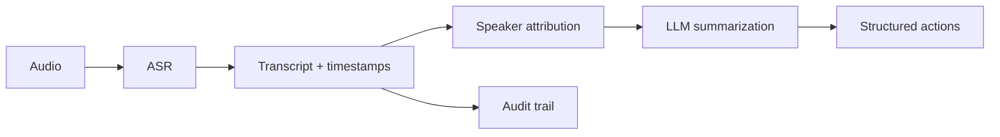

This keeps transcripts auditable and lets you swap ASR models without rewriting your product logic.

### 4. Keep Voice Cloning Behind Consent and Disclosure

Mistral's voice docs explicitly warn against impersonation, cloning voices without consent, fraud, deception, misinformation, and privacy-invasive use. That is not just legal boilerplate. It is product design guidance.

Best practices:

- Store voice consent metadata.
- Label generated audio where required.
- Restrict cloning features by account permissions.
- Watermark or log generated assets where appropriate.
- Do not allow arbitrary third-party voice uploads without review.
- Keep reference audio access-controlled.

### 5. Use RTF and RTFx Carefully

Two common metrics:

```text
RTF  = processing_time / audio_duration
RTFx = audio_duration / processing_time
```

Lower RTF is better. Higher RTFx is better.

Example:

```text
60 seconds of audio processed in 10 seconds:
RTF  = 10 / 60 = 0.166
RTFx = 60 / 10 = 6x
```

Do not compare RTF from a CUDA server to RTFx from a CoreML benchmark without checking formulas, device, precision, model variant, and input length.

### 6. Design for Model Replacement

The winning model this quarter may not be the winning model next quarter.

Create interfaces like:

```swift
protocol SpeechRecognizer {
    func transcribe(_ url: URL) async throws -> Transcript
}

protocol SpeechSynthesizer {
    func synthesize(_ text: String, voice: VoiceSpec) async throws -> AudioAsset
}

protocol SpeakerDiarizer {
    func diarize(_ url: URL) async throws -> [SpeakerSegment]
}
```

Then bind implementations:

```text
SpeechRecognizer:
  - FluidAudioParakeetRecognizer
  - MistralVoxtralRecognizer
  - NeMoParakeetRecognizer

SpeechSynthesizer:
  - LocalVoxtralPresetSynthesizer
  - MistralVoxtralVoiceSynthesizer
  - Qwen3LocalCloneSynthesizer
```

This is how you avoid being trapped by model churn.

## Decision Matrix

| You want... | Pick this first | Why |
|---|---|---|
| Local Mac/iOS dictation | FluidAudio + Parakeet CoreML | Native, local, fast |
| English-only local transcription | FluidAudio Parakeet v2 or Parakeet v2 where supported | Tighter English focus |
| Multilingual European local transcription | FluidAudio Parakeet v3 | 25 European languages |
| Server-side ASR on NVIDIA GPUs | Parakeet via NeMo/NIM | Native CUDA/NVIDIA path |
| Local TTS with preset voices on Mac | Voxtral TTS via MLX-Audio | Works locally, good voice presets |
| Hosted voice cloning | Mistral Voxtral TTS API | `ref_audio` and `voice_id` workflows |
| Local voice cloning on Mac | Qwen3-TTS or Higgs Audio via MLX-Audio | Actually consumes local reference audio |
| Local meeting assistant with speaker labels | FluidAudio | ASR + VAD + diarization in one Apple-native ecosystem |
| Long-file managed STT | Mistral Voxtral Mini Transcribe V2 | Managed diarization/timestamps/context biasing |
| Low-latency voice agent | Mistral Realtime or FluidAudio streaming stack | Choose hosted vs local |

## What We Verified Locally

This workspace ran on macOS ARM with:

- `arm64`
- macOS `26.4.1`
- `uv`
- `ffmpeg`
- Python 3.12 virtual environment
- `mlx-audio 0.4.3`
- `mlx 0.31.2`

Voxtral TTS local generation succeeded with:

```bash
mlx_audio.tts.generate \
  --model mlx-community/Voxtral-4B-TTS-2603-mlx-4bit \
  --text "Hello, Voxtral is now running on Apple Silicon." \
  --voice casual_male \
  --output_path ./audio \
  --file_prefix smoke_test \
  --verbose
```

The first failure was instructive: Voxtral's Tekken tokenizer path required `mistral-common[audio]`. Installing it fixed generation:

```bash
uv pip install -U "mistral-common[audio]"
```

Qwen3-TTS local voice-clone smoke test also succeeded:

```bash
mlx_audio.tts.generate \
  --model mlx-community/Qwen3-TTS-12Hz-0.6B-Base-bf16 \
  --text "This is a local voice cloning test running fully on Apple Silicon." \
  --ref_audio audio/smoke_test_000.wav \
  --ref_text "Hello, Voxtral is now running on Apple Silicon." \
  --output_path ./audio \
  --file_prefix qwen3_local_clone_smoke \
  --verbose
```

Observed lab result:

- Output: `audio/qwen3_local_clone_smoke_000.wav`
- Duration: about 4.16 seconds
- Processing time: about 4.19 seconds
- Peak memory reported by MLX-Audio: about 6.72 GB

This is a local smoke test, not a benchmark. It proves the path works on this machine; it does not rank quality.

## The Bottom Line

Voxtral, FluidAudio, and Parakeet are best understood as three layers:

```text
Voxtral   = speech model family and Mistral product surface
FluidAudio = Apple-native runtime and SDK for local audio apps
Parakeet  = fast ASR engine
```

If you are building a real product, do not ask "which is best?" in the abstract.

Ask:

1. Is the primary job speaking, listening, speaker labeling, or realtime interaction?
2. Must it run fully offline?
3. Is the target app Python, Swift, server GPU, or hosted API?
4. Do I need voice cloning or just voice selection?
5. Do I need diarization and timestamps?
6. What license can I ship?
7. What does my own benchmark audio say?

Then the decision usually becomes obvious:

- **Voxtral** for high-quality TTS and Mistral speech workflows.
- **FluidAudio** for local Apple speech apps.
- **Parakeet** for fast ASR.
- **Qwen3/Higgs** for local Apple Silicon voice cloning today.

The memorable lesson is this: the modern speech stack is no longer one model. It is a routing problem across models, runtimes, devices, licenses, and product requirements.

Choose the layer before you choose the model.

## Source Notes

Primary sources used:

- Mistral Voxtral TTS model card: https://docs.mistral.ai/models/model-cards/voxtral-tts-26-03
- Mistral Speech Generation docs: https://docs.mistral.ai/studio-api/audio/text_to_speech/speech
- Mistral Voices docs: https://docs.mistral.ai/studio-api/audio/text_to_speech/voices
- Mistral Speech-to-Text docs: https://docs.mistral.ai/studio-api/audio/speech_to_text
- Official Voxtral TTS weights: https://huggingface.co/mistralai/Voxtral-4B-TTS-2603
- MLX Voxtral 4-bit model card: https://huggingface.co/mlx-community/Voxtral-4B-TTS-2603-mlx-4bit
- MLX-Audio repository: https://github.com/Blaizzy/mlx-audio
- Qwen3-TTS MLX model card: https://huggingface.co/mlx-community/Qwen3-TTS-12Hz-0.6B-Base-bf16
- FluidAudio introduction: https://docs.fluidinference.com/introduction
- FluidAudio installation: https://docs.fluidinference.com/installation
- FluidAudio ASR getting started: https://github.com/FluidInference/FluidAudio/blob/main/Documentation/ASR/GettingStarted.md
- FluidAudio model guide: https://github.com/FluidInference/FluidAudio/blob/main/Documentation/Models.md
- FluidAudio benchmarks: https://github.com/FluidInference/FluidAudio/blob/main/benchmarks.md
- NVIDIA Parakeet NIM model card: https://build.nvidia.com/nvidia/parakeet-tdt-0_6b-v2/modelcard
- NVIDIA Parakeet v3 Hugging Face model card: https://huggingface.co/nvidia/parakeet-tdt-0.6b-v3
