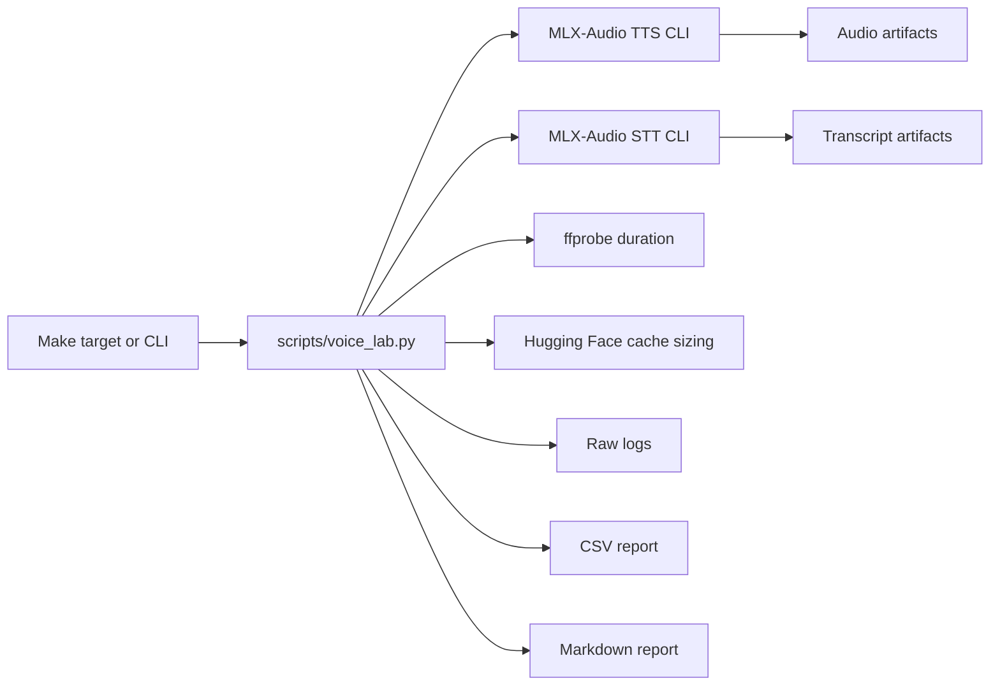
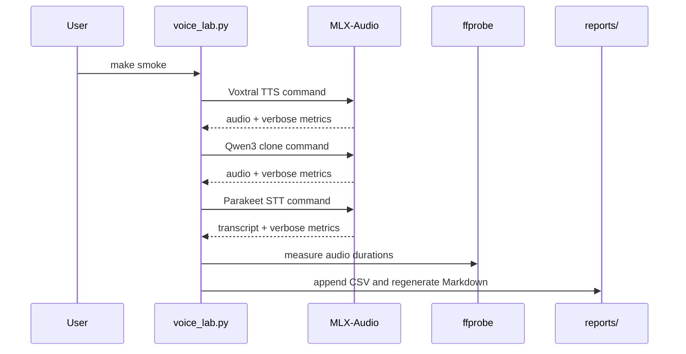

# Architecture

Local Voice AI Lab is a thin orchestration layer around proven model runners.
It keeps the benchmark path close to what a user actually runs in a terminal.

## Design Principles

- Keep model execution external and inspectable.
- Store raw command logs for auditability.
- Prefer reproducible commands over hidden notebooks.
- Separate generated artifacts from tracked documentation.
- Make lightweight checks possible without downloading models.

## Data Flow

## Tracked vs Generated Files

Tracked:

- `scripts/voice_lab.py`
- `Makefile`
- `requirements.txt`
- `docs/`
- `reports/sample_voice_lab_results.csv`
- `reports/sample_voice_lab_report.md`

Ignored/generated:

- `runs/`
- `artifacts/`
- `audio/`
- `reports/voice_lab_results.csv`
- `reports/voice_lab_report.md`
- `reports/index.html`
- local model caches
