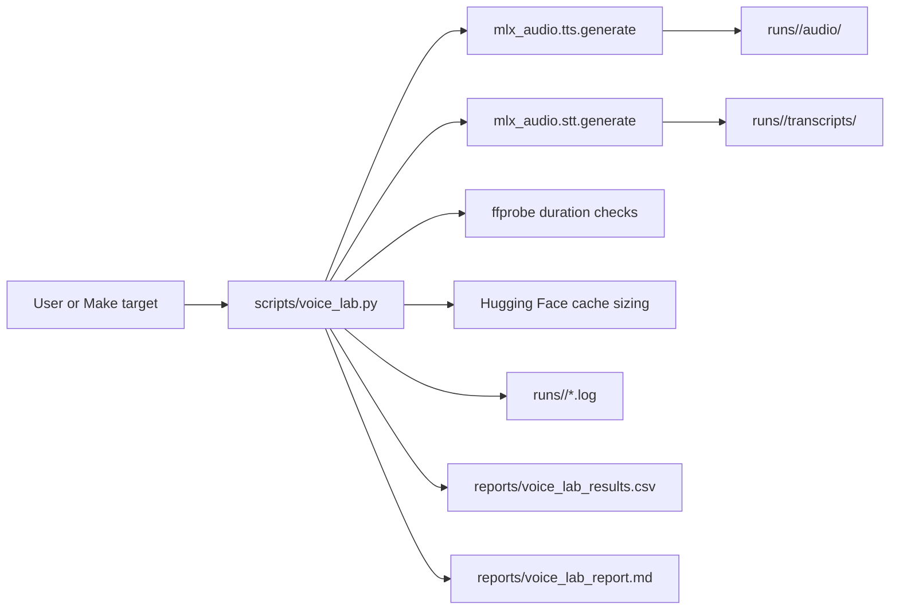

# Local Voice AI Lab Project Specification

Last updated: 2026-06-01

## Summary

Local Voice AI Lab is a repeatable, CLI-first benchmark and demo workspace for
local speech models on Apple Silicon. The project wraps public MLX-Audio
commands, captures raw logs and metrics, writes CSV and Markdown reports, and
keeps generated voice artifacts separate from tracked source files.

The lab currently focuses on local text-to-speech, reference-audio voice clone
experiments, and speech-to-text validation. It also includes a hosted Voxtral
API helper for cases where the official service or one-off reference audio is
required.

## Goals

- Provide a reproducible local workflow for evaluating speech models on macOS
  ARM.
- Compare local TTS, voice clone TTS, and STT model behavior with consistent
  commands, prompts, artifacts, and metrics.
- Preserve the exact command, raw runner output, generated audio, transcripts,
  timing, memory, and model-size evidence for every benchmark row.
- Support privacy-sensitive experiments where reference audio stays local.
- Make safety and licensing constraints explicit before audio is shared,
  published, or used commercially.
- Keep the project easy to publish on GitHub without checking in generated
  personal voice data.

## Non-Goals

- This is not a production voice API or streaming service.
- This is not a public leaderboard. Results are hardware, cache, prompt, and
  runner dependent.
- This project does not grant rights to third-party model weights or generated
  outputs.
- This project does not support impersonation, deceptive audio, or cloning
  voices without consent.
- This project does not replace upstream model cards, safety policies, or
  commercial license review.

## Personas

| Persona | Primary Need | Success Signal |
| --- | --- | --- |
| Local AI evaluator | Compare speech models on one Apple Silicon machine. | Can run `make smoke` and inspect report rows with exact commands and metrics. |
| ML/audio engineer | Debug model runner behavior and benchmark regressions. | Can inspect raw logs, generated files, transcripts, and model cache sizes per run. |
| Product prototyper | Validate whether local speech is viable for a feature. | Can compare speed, memory, quality, and artifact handling before productizing. |
| Privacy-sensitive voice owner | Test a consenting reference voice without uploading it. | Reference audio remains in ignored local artifact paths and is not committed. |
| Technical writer or maintainer | Publish clear project docs on GitHub. | Project goals, commands, methodology, model scope, roadmap, and risks are documented. |

## System Overview

The core runner is `scripts/voice_lab.py`. It intentionally shells out to
MLX-Audio instead of importing model internals so benchmark runs stay close to
the commands a user would run directly in a terminal.



The hosted API path is implemented separately in
`scripts/voxtral_voice_clone_api.py`. It requires `MISTRAL_API_KEY` and writes
the returned audio file to a user-selected output path.

## Repository Interfaces

| Path | Responsibility |
| --- | --- |
| `Makefile` | Human-friendly setup and benchmark entry points. |
| `requirements.txt` | Python packages needed by the local lab and hosted API helper. |
| `scripts/voice_lab.py` | Local benchmark orchestration, metric parsing, artifact writing, CSV append, and Markdown report generation. |
| `scripts/voxtral_voice_clone_api.py` | Hosted Mistral Voxtral one-off reference-audio voice clone helper. |
| `reports/voice_lab_results.csv` | Ignored local append-only benchmark history. |
| `reports/voice_lab_report.md` | Ignored generated summary of recent benchmark rows. |
| `reports/sample_voice_lab_results.csv` | Sanitized benchmark sample for GitHub readers. |
| `reports/sample_voice_lab_report.md` | Sanitized Markdown sample report for GitHub readers. |
| `runs/<run_id>/` | Generated per-run audio, transcripts, and raw logs. Ignored by Git. |
| `artifacts/reference/` | Generated fallback reference audio. Ignored by Git. |

## Model Matrix

Baseline evidence below comes from the existing `reports/voice_lab_results.csv`
rows generated on 2026-05-30. Treat these as local smoke-test evidence, not
universal model claims.

| Capability | Default Model | Runner | Reference Audio | Current Evidence | Best Use |
| --- | --- | --- | --- | --- | --- |
| Preset-voice TTS | `mlx-community/Voxtral-4B-TTS-2603-mlx-4bit` | `mlx_audio.tts.generate` | No; local MLX path uses preset voices. | 2.3682 GiB model, 4.2675 sec wall time, 3.4700 RTFx, 2.7600 GB peak memory. | Fast local Voxtral TTS smoke tests and reference prompt generation. |
| Local voice clone TTS | `mlx-community/Qwen3-TTS-12Hz-0.6B-Base-bf16` | `mlx_audio.tts.generate` | Yes, with exact transcript. | 2.3433 GiB model, 3.9713 sec wall time, 1.7300 RTFx, 6.5800 GB peak memory. | Smallest currently tested local voice clone path. |
| Local voice clone TTS | `mlx-community/higgs-audio-v2-3B-mlx-q6` | `mlx_audio.tts.generate` | Yes, with exact transcript. | 4.4395 GiB model, 64.2490 sec wall time, 0.9900 RTFx, 6.5100 GB peak memory. | Heavier local clone comparison and quality exploration. |
| STT smoke test | `mlx-community/parakeet-tdt_ctc-110m` | `mlx_audio.stt.generate` | Input audio to transcribe. | 0.4274 GiB model, 31.7399 sec wall time, 0.1512 RTFx, 0.5600 GB peak memory. | Lightweight local transcription validation. |
| STT expanded test | `mlx-community/parakeet-tdt-0.6b-v3` | `mlx_audio.stt.generate` | Input audio to transcribe. | Available through `--preset v3`; no baseline row in the current report. | Larger transcription model comparison. |
| Hosted Voxtral TTS | `voxtral-mini-tts-2603` | Mistral API | Saved voice or one-off `ref_audio`. | Not part of local benchmark CSV by default. | Official hosted path, streaming/API validation, and one-off reference audio. |

License notes:

- Voxtral open weights are documented in this repo as CC BY-NC 4.0, so treat
  local/offline Voxtral weight use as non-commercial unless separate rights are
  available.
- Qwen3, Higgs Audio, and Parakeet licensing must be checked against upstream
  model cards before redistribution or commercial use.
- Hosted API use is governed by the provider's current service terms and safety
  policies.

## Benchmark Methodology

### Environment

Use a project-local Python 3.12 environment. The current project notes indicate
that global Python 3.14 may be too new for parts of the ML stack.

Required local tools:

- macOS on Apple Silicon.
- `uv` for environment creation and package installation.
- `ffmpeg` and `ffprobe` for audio conversion and duration measurement.
- Network access for first-run Hugging Face model downloads.
- Optional `MISTRAL_API_KEY` for the hosted API helper.

### Setup

```bash
make setup
```

Equivalent direct setup:

```bash
uv venv --python 3.12 --seed
.venv/bin/python -m pip install -U -r requirements.txt
```

### Benchmark Protocol

1. Record hardware, OS, Python, model id, runner command, and run id for each
   result.
2. Separate first-download runs from warm-cache inference runs. Do not compare
   cold download time to cached inference time.
3. Keep the machine idle enough that background audio, model downloads, or
   other ML jobs do not distort wall-clock or memory results.
4. Use fixed text prompts when comparing model speed.
5. Use the same reference audio and exact reference transcript when comparing
   voice clone models.
6. Generate at least three warm-cache runs for claims that go beyond smoke-test
   validation. Report median and range rather than a single cherry-picked row.
7. Preserve failures in the CSV. Failed commands are useful regression evidence.

### Metrics

| Metric | Source | Meaning |
| --- | --- | --- |
| `wall_time_sec` | Python wrapper timer | End-to-end subprocess runtime. |
| `processing_time_sec` | MLX-Audio output when present | Runner-reported processing time. |
| `input_audio_duration_sec` | `ffprobe` | Duration of reference or STT input audio. |
| `output_audio_duration_sec` | MLX-Audio output or `ffprobe` | Duration of generated audio files. |
| `rtfx` | MLX-Audio for TTS, wrapper formula for STT | Real-time factor. Higher is faster. |
| `peak_memory_gb` | MLX-Audio output | Peak MLX memory reported by the runner. |
| `model_size_gib` | Hugging Face cache or remote repo tree | Approximate model footprint. |
| `transcript` | STT output file | Text produced by transcription runs. |
| `command` | Wrapper command capture | Exact command used for the row. |
| `error` | Failed command output tail | Debug evidence for failed rows. |

### Quality Evaluation

The current lab captures objective runtime and artifact metadata. Human quality
review should be added before making model quality claims.

Recommended quality checks:

- Mean opinion score style review for naturalness, similarity, intelligibility,
  pronunciation, and noise.
- Side-by-side prompt set with short, long, multilingual, number-heavy, and
  abbreviation-heavy text.
- Word error rate or character error rate for STT against known transcripts.
- Clone similarity review only for voices with explicit consent.
- Notes for pronunciation failures, hallucinated words, silence, clipping, and
  pacing issues.

## CLI Commands

### Make Targets

```bash
# Local environment
make setup

# Single-model runs
make voxtral
make qwen3-clone
make higgs-clone
make parakeet

# Suites
make smoke
make all

# Rebuild Markdown report from CSV
make report
```

### Direct Local Commands

```bash
# Voxtral local preset-voice TTS
.venv/bin/python scripts/voice_lab.py voxtral \
  --text "Hello, this is Voxtral running locally on Apple Silicon." \
  --voice casual_male

# Qwen3 local reference-audio voice clone
.venv/bin/python scripts/voice_lab.py qwen3-clone \
  --ref-audio my_voice_sample.wav \
  --ref-text "Exact words spoken in my reference sample." \
  --text "This is a local voice clone benchmark." \
  --confirm-consent

# Higgs Audio local reference-audio voice clone
.venv/bin/python scripts/voice_lab.py higgs-clone \
  --ref-audio my_voice_sample.wav \
  --ref-text "Exact words spoken in my reference sample." \
  --text "This is a Higgs Audio local voice clone benchmark." \
  --confirm-consent

# Parakeet small STT
.venv/bin/python scripts/voice_lab.py parakeet \
  --preset small \
  --audio runs/<run_id>/audio/voxtral_tts_000.wav

# Parakeet v3 STT
.venv/bin/python scripts/voice_lab.py parakeet \
  --preset v3 \
  --audio runs/<run_id>/audio/voxtral_tts_000.wav

# Repeatable smoke suite
.venv/bin/python scripts/voice_lab.py suite --suite smoke

# Heavier suite with Higgs
.venv/bin/python scripts/voice_lab.py suite --suite all

# Regenerate Markdown report
.venv/bin/python scripts/voice_lab.py report
```

### Reference Audio Preparation

Use only your own voice or a voice where you have explicit permission. Convert
input audio to mono 24 kHz WAV before local clone tests:

```bash
ffmpeg -y -i my_voice_original.m4a -ac 1 -ar 24000 my_voice_sample.wav
```

### Hosted API Helper

```bash
export MISTRAL_API_KEY="your-api-key"

.venv/bin/python scripts/voxtral_voice_clone_api.py \
  --ref-audio my_voice_sample.wav \
  --text "Hello, this is a hosted Voxtral voice clone test." \
  --output audio/voice_clone.mp3 \
  --confirm-consent
```

## Artifacts

| Artifact | Git Status | Purpose |
| --- | --- | --- |
| `runs/<run_id>/audio/*.wav` | Ignored | Generated local TTS and clone outputs. |
| `runs/<run_id>/transcripts/*` | Ignored | STT output text, JSON, SRT, or VTT files. |
| `runs/<run_id>/*.log` | Ignored | Raw stdout and stderr for each wrapped command. |
| `artifacts/reference/*.wav` | Ignored | Auto-generated fallback reference audio. |
| `reports/voice_lab_results.csv` | Ignored | Local append-only benchmark history. Review before sharing if rows contain sensitive transcript text. |
| `reports/voice_lab_report.md` | Ignored | Human-readable summary regenerated from CSV. |
| `reports/sample_voice_lab_results.csv` | Tracked | Sanitized example benchmark table for readers. |
| `reports/sample_voice_lab_report.md` | Tracked | Sanitized example Markdown report for readers. |
| Hugging Face cache | Outside repo by default | Downloaded model snapshots used for local runs. |

Generated audio may contain personal voice data. Keep raw voice samples,
generated clones, and private transcripts out of Git unless explicit consent
and publication rights are documented.

## Safety and Licensing

Safety rules:

- Clone only your own voice or a voice with explicit, documented consent.
- Do not impersonate people or publish deceptive audio.
- Label generated audio when shared outside the local workspace.
- Do not commit API keys, private reference audio, or private generated voice
  samples.
- Keep consent metadata with any reusable reference sample.
- Remove or redact sensitive transcript text before publishing reports.

Licensing rules:

- Check upstream model cards before publishing generated outputs, redistributing
  weights, or using outputs commercially.
- Treat Voxtral local open-weight use as non-commercial unless separate rights
  are available.
- Keep provider API terms separate from local model weight licenses.
- Include model ids and exact commands in benchmark rows so future license
  review can trace which model produced which artifact.

## Acceptance Criteria

A local benchmark run is considered valid when:

- `make setup` has completed in a Python 3.12 virtual environment.
- `make smoke` or an equivalent direct `suite --suite smoke` command completes.
- Local `reports/voice_lab_results.csv` contains rows for Voxtral TTS, Qwen3 clone,
  and Parakeet small STT.
- Local `reports/voice_lab_report.md` has been regenerated from the CSV.
- Each row records status, model id, wall time, RTFx when available, peak memory
  when available, output file paths, log file path, and exact command.
- Generated audio and reference artifacts remain in ignored paths.
- Any custom reference audio has documented consent and is not committed.

## Open Questions

- Should the project add an explicit machine-readable run manifest per run?
- Should reports include median and range for repeated runs by default?
- Should a license registry be tracked for each model id and version?
- Should the report command grow a first-class `--export-sanitized` option?
- Should hosted API runs be captured in the same CSV schema as local runs?
